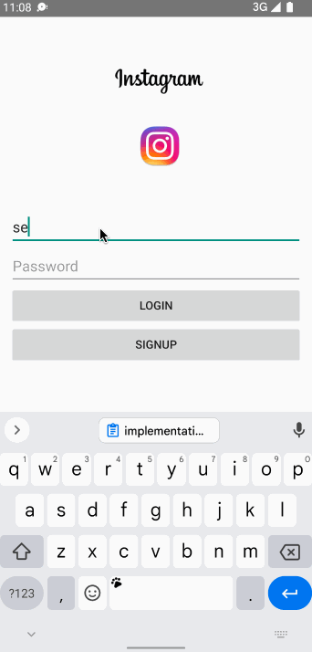

# Project 3 Unit 6 - *Simple Instagram*

**Simple Instagram** is an android clone of the widely known Instagram app that utilizes a Parser backend for storing users and posts.
Submitted by: **John Sena Akoto**

Time spent: **7** hours spent in total

## User Stories

The following **required** functionality is completed:

* [x] User can **view the last 20 posts**
* [x] User can **viewing all posts (feed view), compose (capture photos form camera) and profile tabs (posts made) using fragments and a Bottom Navigation View**
* [x] User can **can pull to refresh the last 20 posts**

The following **optional** features are implemented:
* [x] User sees **app icon in home screen and styled launch screen that resembles real Instagram page**
* [x] App has been **instagram branded**

The following **additional** features are implemented:

* [x] Nice UI additions

## Video Walkthrough

Here's a walkthrough of implemented user stories:

GIF created with [LiceCap](http://www.cockos.com/licecap/).

## Notes

Describe any challenges encountered while building the app.
The time in the android emulator is wrong, which causes relative timestamp to be wrong

## License

    Copyright [yyyy] [name of copyright owner]

    Licensed under the Apache License, Version 2.0 (the "License");
    you may not use this file except in compliance with the License.
    You may obtain a copy of the License at

        http://www.apache.org/licenses/LICENSE-2.0

    Unless required by applicable law or agreed to in writing, software
    distributed under the License is distributed on an "AS IS" BASIS,
    WITHOUT WARRANTIES OR CONDITIONS OF ANY KIND, either express or implied.
    See the License for the specific language governing permissions and
    limitations under the License.
